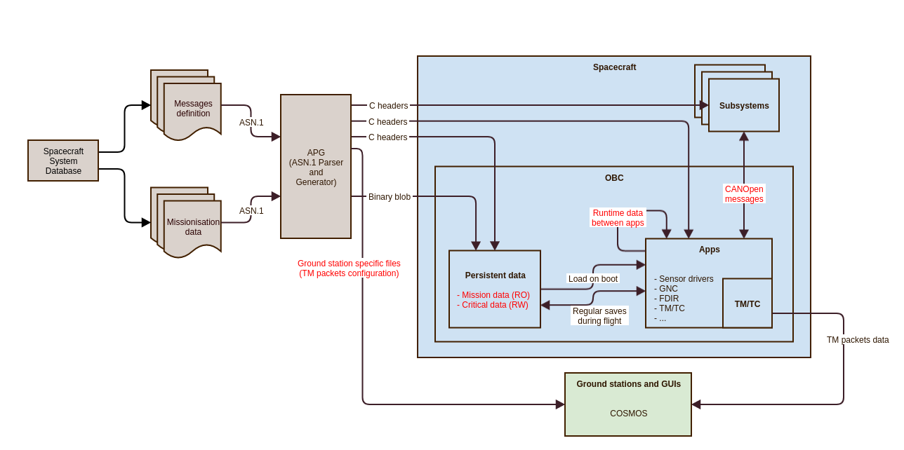
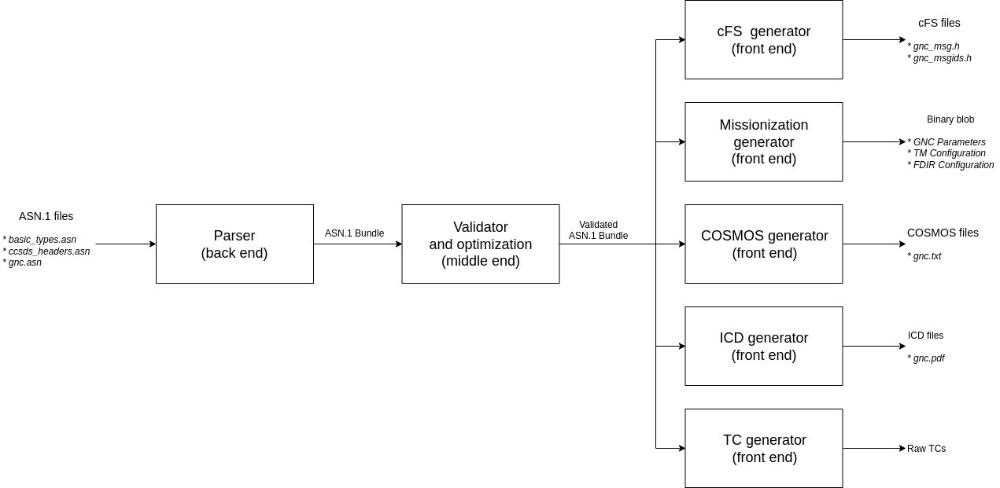
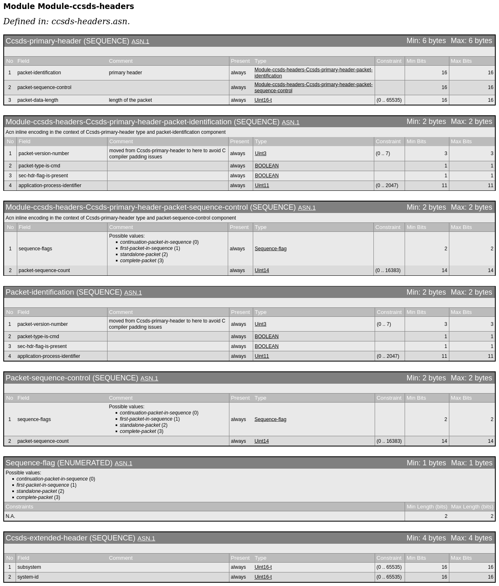

ASN.1 language
==============

Why ASN.1
---------

*Abstract Syntax Notation One (ASN.1) is a standard interface description
language for defining data structures that can be serialized and deserialized
in a cross-platform way* (:ref:`[RD3] Wikipedia - ASN.1 <rd3_wiki_asn1>`).

Spacecraft mission data can be divided into exchanged data and stored data and
both data groups have to be managed on ground and onboard spacecraft. For example,
the format of telemetry sent by spacecraft to the ground
(exchanged data) must be known by spacecraft and ground software
as well as the format and contents of spacecraft equipment
configuration that are defined in ground spacecraft databases
must be known and shared by spacecraft flight software (stored data). The term
"missionisation" refers to the customisation of flight software with
mission-specific data which is a process that happens when a spacecraft is
prepared for flight on the ground.

The ASN.1 format can be used for definition and storage of both stored
and exchanged data with all data managed as a consistent
single dataset. The mission data are stored in ASN.1 text files which can be
generated from the spacecraft system database (interface TBD) and put under
configuration control close to flight software. The stored ASN.1 database
then serves as a single source of truth for the subsequent generation of data
structures, Interface Control Documents, package definitions for test scripting, etc.

The following diagram summarizes the different types of data used:

* Mission data (missionisation)
* Critical data (saved state)
* Runtime data (scratchpad)
* CANopen messages

**Advantages**

There are a few advantages of using ASN.1 as a single source of truth to define
every piece of data in flight software spacecraft database:

- Generation of all artifacts is a straightforward process because the data is
  in one place and there is no need to collect information from several sources.

- When the data is updated, a single place needs to be edited which reduces
  manual work, prevents mistakes and waste of time.

- Verifications and sanity checks are included in APG between the parsing and
  generation phases. The supported checks include:

  - Verification of uniqueness of packet numbers.
  - Verification of integrity of stored data structures and generated artifacts.
  - Verification of C structs memory alignment.

ASN.1 modules
-------------

Module structure
~~~~~~~~~~~~~~~~

Any ASN.1 project must contain at least 1 file with the ``.asn`` file extension.
There can be only one module per file.

The first line of the file defines an ASN.1 module:

.. code-block:: text

    Module-sample-module DEFINITIONS AUTOMATIC TAGS ::= BEGIN

* ``Module-sample-module`` represents the name of the current ASN.1 module. The module
  name description must use dashes in between words, and the first word must be
  "Module".

* ``DEFINITIONS`` is a keyword which indicates that this ASN.1 module contains
  definitions.

* ``AUTOMATIC TAGS`` is a keyword that refers to automatic tagging of module
  definitions. Tagging adds a numeric tag to a definition in a module. Excluding
  it would not allow multiple assignments to the same type within any sequence
  or choice.

* ``::=`` is a separator which represents assignment of a new type to any
  previously-defined type.

* ``BEGIN`` is a keyword that indicates the start of the definition of the current
  ASN.1 module.

Any ASN.1 file ends with the keyword ``END``.
It must be located at the end of the file.

Imports
~~~~~~~

When having multiple modules, dependencies between them can be expressed after
the header of the module.
In ASN.1, dependencies are expressed if any definitions in a module require
types from other modules.
This is also the only line in ASN.1 files that ends in a semicolon.

The syntax is:

.. code-block:: text

    IMPORTS Uint16-t, Uint8-t FROM Module-simple-types;

* ``IMPORTS`` is a keyword to define the imported definitions from other ASN.1 files.
* ``Uint16-t, Uint8-t`` these types represent an example importing two types
  called Uint16-t and Uint8-t from an example module. All imported definitions
  come in the form of a comma-separated list.
* ``FROM`` precedes the module that the definitions are imported from.
* ``Module-simple-types`` is a sample module that the aforementioned definitions
  are imported from.

Circular imports are not allowed within any ASN.1 project.

Type definitions
~~~~~~~~~~~~~~~~

There can be any number of type definitions in a module.
They can be placed regardless of the order that they are used in.
Definitions do not have to be separated by a comma, nor do they depend on new
lines, or indentation.

Commas are only used for separation within a choice type, a sequence type,
or an enumerated type, when there are two or more values.

Comments
~~~~~~~~

Comments are written in the file only at the ends of most lines.
This is done with two dashes, followed by the comment.
These rules are enforced by the grammar of the parser.

.. code-block:: text

    -- this is a comment

ASN.1 syntax
------------

An ASN.1 file can contain value and type assignments, as well as type definitions.

**Type definitions**

Type definitions are the only way to give a new name to a previously-mentioned
type.
This new type must start with one uppercase letter, and must include the
assignment separator.

For example: ``Sample-boolean ::= BOOLEAN``.

**Value and type assignments**

Value and type assignments are used in sequence types, choice types and
enumerated types.
These assignments allow the aforementioned types to have a field of a certain
value or type.
These fields must start with a lowercase letter and do not include the
assignment separator.

For example: ``sample-boolean (TRUE)``.

Simple definitions
~~~~~~~~~~~~~~~~~~

ASN.1 contains some built-in data types that are similar to other programming
languages. These are called simple definitions. They do not have any
dependencies on other definitions, or other data types, and are the easiest
to define new data types with.

**Boolean** - https://www.itu.int/ITU-T/studygroups/com17/languages/X.680-0207.pdf

Boolean types are used to model the values of a logical (that is, two-state)
variable, for example, the answer to a yes-or-no question. The boolean type
can take the value of either TRUE, or FALSE.

.. code-block:: text

    Sample-boolean ::= BOOLEAN

**Integer** - https://www.itu.int/ITU-T/studygroups/com17/languages/X.680-0207.pdf

Integer number types are used to model the values (for all practical purposes,
unlimited in magnitude) of a cardinal or integer variable. The range must be
defined in brackets, with a minimum value and a maximum value, separated by
two periods.

.. code-block:: text

    Sample-integer ::= INTEGER(-3..9)

**Real** - https://www.itu.int/ITU-T/studygroups/com17/languages/X.680-0207.pdf

Real number types are a continuation to integer types, as they share similar
traits. The distinction between these types is represented by the
floating-point representation of real numbers. The range must be defined in
brackets, with a minimum value and a maximum value, separated by two periods.

.. code-block:: text

    Sample-real ::=  REAL(0.5..255.0)

**String** - https://www.obj-sys.com/asn1tutorial/node128.html

This type represents an array of characters written in the IA5 (T.50)
encoding. The size of this array must be defined in brackets, with the keyword
SIZE, followed by a number within brackets, corresponding to the length of the
array created.

.. code-block:: text

    Sample-string ::= IA5String(SIZE(128))

**Null** - https://www.itu.int/ITU-T/studygroups/com17/languages/X.680-0207.pdf

The NULL type is supported by the ASN.1 standard but its use is forbidden by
the APG tool to avoid any confusion that could be caused by the presence of the
NULL type in the generated C and COSMOS artifacts.

.. code-block:: bash

    Sample-null ::= NULL

Sequence
~~~~~~~~

Sequence types are used to model a collection of variables whose types are the
same, whose number is known and modest, and whose order is significant,
provided that the make-up of the collection is unlikely to change from one
version of the protocol to the next. The sequence type consists of a
collection of type and value assignments. Curly brackets must wrap all the
assignments of the sequence. There can be no new definitions created within a
sequence.
https://www.itu.int/ITU-T/studygroups/com17/languages/X.680-0207.pdf

.. code-block:: text

    Sample-packet ::= SEQUENCE {
      number (35),
      type NULL
    }

Sequences can also be nested within other sequences. When nesting them, the
curly braces must be contained within a pair of round brackets, with the
keywords  WITH COMPONENTS  immediately after the round brackets (example
below). The first nested sequence must be a type assignment, while the other
ones only require the name, as they are expected to have been defined
previously in the project.

.. code-block:: text

    Sample-sequence ::= SEQUENCE {
      sample-first-nest Second-sequence (WITH COMPONENTS {
        sample-second-nest (WITH COMPONENTS {
          sample-boolean (TRUE)
        })
      })
    }

    Second-sequence ::= SEQUENCE {
      sample-second-nest Second-nest
    }

    Second-nest ::= SEQUENCE {
      sample-boolean BOOLEAN
    }

Choice
~~~~~~

The choice type is similar to a sequence type, in that it is also a collection
of type definitions and assignments. The distinction between the two comes
from the fact that all of the fields of the choice type are stored in one
memory location. Thus, it can only store a single value at any given time.

.. code-block:: text

    Sample-string ::= CHOICE {
      sample-boolean BOOLEAN,
      sample-integer INTEGER(0..7)
    }

Enumerated
~~~~~~~~~~

Enumerated types are used to model the values of a variable with three or more
states. Assign values starting with zero if their only constraint is
distinctness.
https://www.itu.int/ITU-T/studygroups/com17/languages/X.680-0207.pdf

The syntax is similar to that of a sequence type. A valid enumerated
type contains no duplicate integer values, and all integer values must be in
consecutive order, starting from 0.

.. code-block:: text

    DayOfTheWeek ::= ENUMERATED {
      sunday(0),
      monday(1),
      tuesday(2),
      wednesday(3),
      thursday(4),
      friday(5),
      saturday(6)
    }

    firstDay DayOfTheWeek ::= sunday

APG design
==========

This section will present the tool's architecture and internals.

First, the parser, which is reading the ASN.1 input, will be covered.
Second, the middle end, in charge of verification and optimizations, will be
presented.
Finally, the various generators (flight software cFS, COSMOS ground station,
etc) will be briefly covered.

Introduction
------------

APG is a Python tool.
It takes advantage of the flexible language and its rich ecosystem of libraries.

The following diagram present an overview of the data flow.
The input, on the left, is a set of ASN.1 files.
The output, on the right, depends on the executed generator.
The generators cover anything that can be generated from the input and might
need needed for the project (C headers for the flight software, configuration
files for the ground station, generated documentation, etc).

Intermediate representation
---------------------------

The intermediate representation format is a custom Python object ``ASN1Bundle``,
defined in ``asn1_parser/asn1_parser/asn1/asn1_bundle.py``.
An ``ASN1Bundle`` represent a set of ASN.1 files.
It is a tree like structure.

.. Note: manually splitting inline code to avoid "Overfull \hbox" messages

Each ASN.1 file is represented by an ``Asn1Module``, defined in
``asn1_parser/asn1_parser/asn1/`` ``grammar_elements/asn1_module.py``.
Each ``Asn1Module`` is a list of definitions, with some metadata.

Each ASN.1 definition is represented by one of the Python objects ``Choice``,
``Enumerated``, ``Sequence`` or ``SimpleDefinition`` found in
``asn1_parser/asn1_parser/asn1/grammar_elements/``.

An ``Enumerated`` is made of ``EnumeratedItem`` s.

A ``Choice`` or a ``Sequence`` is made of ``KeyTypePair`` s.
A ``KeyTypePair`` is either a list of ``(name, type)`` tuples or a ``WithComponents``.
A ``WithComponents`` is made of ``ComponentsItem`` s.
A ``ComponentsItem`` is made of ``(name, type)`` tuples.

.. TODO diagram grammar.dot

Parser
------

The Parser reads a set of ASN.1 files and generate the intermediate
representation, an ``ASN1Bundle``.

It uses the Python library `textX <http://textx.github.io/textX/stable/>`_.

The ASN.1 grammar is defined in ``asn1_parser/asn1_parser/asn1/grammar.py``.
It defines a set of grammar elements and their syntax.

Each grammar element is parsed into a Python object, which is implemented in
``asn1_parser/asn1_parser/asn1/grammar_elements/``.

Verification and optimizations
------------------------------

While and after parsing, the APG runs several processors on the objects and on
the whole model.
These processors can modify the intermediate representation (to add new
information or rewrite it to make it easier to use), or verify that some
invariants are respected (for instance to make sure that all types are defined).

.. Note: manually splitting inline code to avoid "Overfull \hbox" messages

These processors are defined in several files:
``asn1_parser/asn1_parser/asn1/asn1_bundle_builder.py``,
``asn1_parser/asn1_parser/asn1/processor.py`` and
``asn1_parser/asn1_parser/asn1/validation/`` ``asn1_bundle_validator.py``.

* ``_check_imported_types_and_check_components()``: ensures that imported types are defined in the imported module
* ``_resolve_dependencies()``: ensures that all types are declared
* ``_validate_unique_module_names()``: ensures that all module name is unique
* ``_resolve_types()``: walk the tree and link a textual ASN.1 type to its Python object
* ``_check_types_once_defined()``: ensures that types are not defined more than once
* ``model_processor_check_used_types_defined()``: ensures that all types are defined
* ``model_processor_check_used_components_defined()``: ensures that a ``WithComponents`` is valid
* ``str_to_bool()``: converts ASN.1 booleans to Python booleans
* ``endianness_to_bool()``: parses and sets the endianness
* ``check_range()``: ensures that a range is valid: its start is smaller than its end
* ``null_to_none()``: converts ASN.1 ``NULL`` to Python ``None``
* ``check_comment()``: ensures that the comments are valid
* ``check_enumerated()``: ensures that the enumerations are valid

Generators
----------

Flight software
~~~~~~~~~~~~~~~

The flight software uses the message definitions.
APG generates several C headers following cFS conventions:

* ``<module_name>_msg.h``: where the messages are defined, mostly as C ``struct`` s and ``enum`` s.
* ``<module_name>_msgids.h``: where the message IDs are defined as a C ``define`` s.

The generator makes sure that the C syntax is valid and follows the best
practices: circular inclusion header guards, using ``__attribute__((packed))``
where needed, injecting comments parsed from the ASN.1 files to make the
generated files more human readable, etc.

Missionization
~~~~~~~~~~~~~~

*Note: work in progress*

The (static) flight software is configured for a specific mission with a set of
mission parameters.
These parameters are stored in a single binary object generated from one or
several ASN.1 file(s) and read by the flight software which has the same
definitions and knows how to make sense of it.

ICD
~~~

*Note: work in progress*

The ICD generator outputs a human readable version of the ASN.1 message and
their binary layout.
The partial ICD of each message is generated as a pdf or image table ready to be
included in a broader ICD document.

In order to build on existing tools when possible, the ICDs are generated with
``asn1scc``, an open source ASN.1 compiler.
It is an ASN.1 compiler developed mainly by Thanassis Tsiodras under the
auspices of the European Space Agency.
Its source code is available on `Github <https://github.com/ttsiodras/asn1scc/>`_.

An example ICD generated by this tool is shown below.

Ground stations (COSMOS)
~~~~~~~~~~~~~~~~~~~~~~~~

Ground station configuration files can be generated.
These files include the definition of the TMs and how to decode them.

One such ground station interface is COSMOS and is already being used by PTS for
debuging purposes.
COSMOS's documentation is available via :ref:`[RD2] <rd2_cosmos>`.

TC testing
~~~~~~~~~~

*Note: work in progress*

Developer tools
===============

APG
---

The tool's dependencies can be installed with the following:

.. code-block:: bash

    pip3 install -r requirements.txt

You can now run APG:

.. code-block:: bash

    python3 asn1_parser/main.py --help

Tests and lints
---------------

Before running tests and lints, make sure the dependencies are installed:

.. code-block:: bash

    pip3 install -r requirements.txt

APG has two ``invoke`` tasks to run tests:

.. code-block:: bash

    invoke test-unit
    invoke test-integration

    # Both can be run in one command with:
    invoke test-all

APG has several ``invoke`` tasks to run lints:

.. code-block:: bash

    invoke lint-black-diff
    invoke lint-pylint
    invoke lint-flake8
    invoke lint-mypy

    # They can all be run in one command with:
    invoke lint-all

Documentation
-------------

The documentation build system depends on a few packages.
Install them with the following commands:

.. code-block:: bash

    apt install latexmk texlive-xetex texlive-fonts-recommended fonts-dejavu
    pip3 install -r requirements.txt

To generate the documentation and open the resulting file, run:

.. code-block:: bash

    invoke docs-sphinx
    invoke docs-see

    # Or run both in one command:
    invoke docs-all

Usage reference
===============

Prerequisite
------------

APG depends on several packages.
Install them with:

.. code-block:: bash

    pip3 install -r requirements.txt

Basic usage
-----------

Introduction
~~~~~~~~~~~~

APG has one generator for each target (cFS, COSMOS, etc).
Most parameters and flags are the same for all these generators, but some
generators might have specific flags.

The tool needs at least the following parameters:

* Which kind of files to generate (``generate-cosmos`` or ``generate-cfs``)
* Which ASN.1 modules to generate (``--asn1-modules``)
* The ASN.1 files (positional ``input_paths [input_paths ...]``)

Note: *all* the non builtin ASN.1 types encountered must be explicitly defined
somewhere in an ASN.1 file, and this file must be passed in the positional
parameter ``input_paths``.
This means that the list of ASN.1 files ``input_paths`` can grow quite large, as
all the dependencies are specified.
The ``--asn1-modules`` flag allow generating only a subset of ASN.1 modules, not
all the modules defined in ``input_paths``.

Quick start
~~~~~~~~~~~

*Note: for a complete, step-by-step, tutorial, refer to the* `Tutorial`_ *section.*

The following demonstrates a basic usage for all the generators.

.. code-block:: bash

    # cFS
    python3 asn1_parser/main.py \
        generate-cfs \
        --asn1-modules=gnc \
        --output-dir=build/demo/cfs/ \
        src/common/ccsds-headers.asn \
        src/common/cfe-headers.asn \
        src/common/simple-types.asn \
        src/demo/gnc.asn

    # COSMOS
    python3 asn1_parser/main.py \
        generate-cosmos \
        --asn1-module=gnc \
        --asn1-messages=Demo-gnc-data-tlm \
        --output-file-name=gnc \
        --output-dir=build/demo/cosmos/ \
        src/common/ccsds-headers.asn \
        src/common/cfe-headers.asn \
        src/common/simple-types.asn \
        src/demo/gnc.asn

CLI options
-----------

cFS generator
~~~~~~~~~~~~~

.. code-block:: bash

    $ python3 asn1_parser/main.py generate-cfs --help
    usage: main.py generate-cfs [-h] --asn1-modules ASN1_MODULES [--output-dir OUTPUT_DIR] input_paths [input_paths ...]

    Generate command: input ASN.1 files are generated into cFS files.

    positional arguments:
      input_paths           One or more folders with *.asn files

    optional arguments:
      -h, --help            show this help message and exit
      --asn1-modules ASN1_MODULES
                            ASN.1 modules to generate.
      --output-dir OUTPUT_DIR
                            Output folder

COSMOS generator
~~~~~~~~~~~~~~~~

.. code-block:: bash

    $ python3 asn1_parser/main.py generate-cosmos --help
    usage: main.py generate-cosmos [-h] --asn1-module ASN1_MODULE --asn1-messages ASN1_MESSAGES --output-file-name OUTPUT_FILE_NAME [--output-dir OUTPUT_DIR] input_paths [input_paths ...]

    Generate command: input ASN.1 files are generated into COSMOS files.

    positional arguments:
      input_paths           One or more folders with *.asn files

    optional arguments:
      -h, --help            show this help message and exit
      --asn1-module ASN1_MODULE
                            ASN.1 module to generate.
      --asn1-messages ASN1_MESSAGES
                            ASN.1 messages to generate.
      --output-file-name OUTPUT_FILE_NAME
                            Output COSMOS file name.
      --output-dir OUTPUT_DIR
                            Output folder

Conventions
-----------

APG enforces or recommends several conventions.

Some conventions come from the official ASN.1 specification, some are due to a
generator's own conventions or limitations (for instance cFS), some are simply
best practices.

Some conventions are hard coded into the grammar or the generators code, others
are entirely optional.

This section attempts to cover all implicit and explicit customs, and
highlighting which ones should be - or must be - followed.

Naming conventions
~~~~~~~~~~~~~~~~~~

**ASN.1: module name and filename**

The name of an ASN.1 module, when specified at the top of the module or in
``IMPORTS`` statements, should be the *long* form, with a ``Module-`` prefix.
It can contain lowercase letters, dashes and numbers.
This is enforced by the grammar of the parser.
Example: ``Module-example-1``.

The name of an ASN.1 module, when specified in the CLI, should be the *short*
form, without the ``Module-`` prefix.
Example: ``python3 asn1_parser/main.py [...] --asn1-module=example-1 [...]``.

The filename of an ASN.1 module is entirely flexible, although a sane convention
is to use the same name as the (short) module name.
Example: ``example-1.asn``.

**ASN.1: module header and footer**

The header must be ``Module-<module-name> DEFINITIONS AUTOMATIC TAGS ::= BEGIN``.
The footer must be ``END``.
This is enforced by the ASN.1 specification and the grammar of the parser.

Example:

.. code-block:: text

    -- === File: example-1.asn ===

    Module-example-1 DEFINITIONS AUTOMATIC TAGS ::= BEGIN

      -- ASN.1 definitions here

    END

**ASN.1: imports**

Importing ASN.1 types is done with the ``IMPORTS`` and ``FROM`` statements.
The module name from where the types are imported is the *long* form, with the
``Module-`` prefix.

1. Types must be comma-separated.
1. Importing types from several modules must be done in a single ``IMPORTS`` statement.

This is enforced by the grammar of the parser.

Examples:

.. code-block:: text

    IMPORTS Uint8-t, Uint16-t, Uint32-t FROM Module-simple-types;

.. code-block:: text

    IMPORTS
      Uint8-t, Uint16-t, Uint32-t FROM Module-simple-types
      Ccsds-primary-header FROM Module-ccsds-headers
    ;

**ASN.1: types**

ASN.1 types must start with a capital letter, and may contain any letters or dashes.

This is enforced by the grammar of the parser.

Example:

.. code-block:: text

    Uint8-t ::= INTEGER(0..255)

**ASN.1: definition items**

ASN.1 Sequence, Enumerated or Choice items must start with a lowercase letter,
and may contain any letters or dashes.

This is enforced by the grammar of the parser.

Example:

.. code-block:: text

    Ccsds-extended-header ::= SEQUENCE {
      subsystem Uint16-t,
      system-id Uint16-t
    }

In this example, the Sequence items ``subsystem`` and ``system-id`` are
lowercase letters only.
The types ``Ccsds-extended-header`` and ``Uint16-t`` start with a capital
letter.

**ASN.1: comments and units**

ASN.1 comments are prefixed with ``--``.
The parser does not accept them anywhere, but in many places.
A good rule of thumb is that they are accepted at the end of most lines.

After a member, a special syntax can be used to specify:

* endianness: by default, big endian is used. Little endian can be specified
  with ``ENDIANNESS(LITTLE)``.
* unit: the unit can be specified inside brackets ``[]``. No validation is
  performed: as far as the parser is concerned, ``[rockets/schnitzel]`` is the
  perfectly valid unit *Rockets per Schnitzel*.

This is enforced by the grammar of the parser.

Example:

.. code-block:: text

    Payload-gnc ::= SEQUENCE {
      afield Real-range,      -- this is just a comment
      position Real-range,    -- [m] this is a comment with a unit (meters)
      velocity Real-range,    -- ENDIANNESS(LITTLE) comment with the endianness
      thrust Real-range       -- ENDIANNESS(LITTLE) [N] both endianness and unit
    }

Tree structure
~~~~~~~~~~~~~~

The tree structure is flexible and not enforced, but the following is a sane convention:

Input (ASN.1) files:

* ``src/common/``
* ``src/<project>/``

Output (generated) files:

* ``build/<project>/<generator>/`` (for example: ``build/demo/cfs/``)

Tutorial
========

This example assumes the following scenario:
an ASN.1 module ``gnc`` is defined in a ``src/demo/gnc.asn`` file.
Its dependencies are defined in ``src/common/ccsds-headers.asn``,
``src/common/cfe-headers.asn`` and ``src/common/simple-types.asn``

We will see how to generate cFS and COSMOS files into a ``build/`` folder.

Files and tree structure
------------------------

As introduced, this example assumes the following tree structure:

.. code-block:: bash

    $ tree src/
    src/
    ├── common
    │   ├── ccsds-headers.asn
    │   ├── cfe-headers.asn
    │   └── simple-types.asn
    └── demo
        └── gnc.asn

A first file, ``src/common/simple-types.asn``, defines the standard C types, as
well as integers of various bit size:

.. code-block:: text

    Module-simple-types DEFINITIONS AUTOMATIC TAGS ::= BEGIN

      Real-range ::= REAL(-1.175e-38 .. +3.402e+38)

      Uint8-t ::= INTEGER(0..255)
      Uint16-t ::= INTEGER(0..65535)
      Uint32-t ::= INTEGER(0..4294967295)
      Uint64-t ::= INTEGER(0..18446744073709551615)

      Uint3 ::= INTEGER(0..7)
      Uint11 ::= INTEGER(0..2047)
      Uint14 ::= INTEGER(0..16383)

    END

The file ``src/common/ccsds-headers.asn`` defines CCSDS header types:
sequences (C struct) and enumerations:

.. code-block:: text

    Module-ccsds-headers DEFINITIONS AUTOMATIC TAGS ::= BEGIN

      IMPORTS Uint3, Uint11, Uint14, Uint8-t, Uint16-t, Uint32-t FROM Module-simple-types;

      Ccsds-primary-header ::= SEQUENCE { -- primary header
        packet-identification Packet-identification,
        packet-sequence-control Packet-sequence-control,
        packet-data-length Uint16-t -- length of the packet
      }

      Packet-identification ::= SEQUENCE {
        packet-version-number Uint3,
        packet-type-is-cmd BOOLEAN,
        sec-hdr-flag-is-present BOOLEAN,
        application-process-identifier Uint11
      }

      Packet-sequence-control ::= SEQUENCE {
        sequence-flags Sequence-flag,
        packet-sequence-count Uint14
      }

      Sequence-flag ::= ENUMERATED {
        continuation-packet-in-sequence (0),
        first-packet-in-sequence (1),
        last-packet-in-sequence (2),
        complete-packet(3)
      }

      Ccsds-extended-header ::= SEQUENCE {
        subsystem Uint16-t,
        system-id Uint16-t
      }

    END

The file ``src/common/cfe-headers.asn`` defines cFE header types:

.. code-block:: text

    Module-cfe-headers DEFINITIONS AUTOMATIC TAGS ::= BEGIN

      IMPORTS Uint8-t, Uint16-t, Uint32-t FROM Module-simple-types
              Ccsds-primary-header FROM Module-ccsds-headers;

      Cfe-cmd-header ::= SEQUENCE {
        primary Ccsds-primary-header,
        secondary Cfe-tc-secondary-header
      }

      Cfe-tlm-header ::= SEQUENCE {
        primary Ccsds-primary-header,
        secondary Cfe-tm-secondary-header,
        spare Uint32-t
      }

      Cfe-tc-secondary-header ::= SEQUENCE {
        function-code Uint8-t,
        checksum Uint8-t
      }

      Cfe-tm-secondary-header ::= SEQUENCE {
        seconds Uint32-t, -- [sec]
        subsecs Uint16-t -- unit: 2**-16 sec = 0.015 ms
      }

    END

Finally, project specific messages are defined in their own files, such as
``src/demo/gnc.asn``.

In this case, a message is defined for a dummy GNC application.
Note the ``primary`` header values specifying that it is a telemetry
(``packet-type-is-cmd (FALSE)``) with an id of 42
(``application-process-identifier (42)``).

.. code-block:: text

    Module-gnc DEFINITIONS AUTOMATIC TAGS ::= BEGIN

      IMPORTS Cfe-tlm-header FROM Module-cfe-headers
              Real-range FROM Module-simple-types;

      Demo-gnc-data-tlm ::= SEQUENCE {
        header Cfe-tlm-header (WITH COMPONENTS {
          primary (WITH COMPONENTS {
            packet-identification (WITH COMPONENTS {
              packet-version-number (0),
              packet-type-is-cmd (FALSE),
              sec-hdr-flag-is-present (TRUE),
              application-process-identifier (42)
            })
          })
        }),
        payload Payload-gnc-data-tlm
      }

      Payload-gnc-data-tlm ::= SEQUENCE {
        pos Real-range,   -- ENDIANNESS(LITTLE) [m]
        vel Real-range,   -- ENDIANNESS(LITTLE) [m/s]
        acc Real-range,   -- ENDIANNESS(LITTLE) [m/s^2]
        p Real-range,     -- ENDIANNESS(LITTLE)
        i Real-range,     -- ENDIANNESS(LITTLE)
        d Real-range,     -- ENDIANNESS(LITTLE)
        thrust Real-range -- ENDIANNESS(LITTLE) [N]
      }

    END

Generating files
----------------

With the above convention, the following demonstrates a basic usage for all the
generators.

cFS generator
~~~~~~~~~~~~~

The following command generates the cFS files into the folder
``build/demo/cfs/``.

.. code-block:: bash

    python3 asn1_parser/main.py \
        generate-cfs \
        --asn1-modules=gnc,ccsds-headers,cfe-headers,simple-types \
        --output-dir=build/demo/cfs/ \
        src/common/ccsds-headers.asn \
        src/common/cfe-headers.asn \
        src/common/simple-types.asn \
        src/demo/gnc.asn

The resulting tree structure is as follow:

.. code-block:: bash

    $ tree build/
    build/
    └── demo
        └── cfs
            ├── ccsds_headers_msg.h
            ├── cfe_headers_msg.h
            ├── gnc_msg.h
            ├── gnc_msgids.h
            └── simple_types_msg.h

Most files are rather simple and uninteresting, but the two GNC files are to be
highlighted.

The file ``build/demo/cfs/gnc_msg.h`` will look as follow.

The ASN.1 Sequence ``Demo-gnc-data-tlm`` is encoded as a C struct named
``Demo_gnc_data_tlm``.

.. code-block:: c

    #ifndef ASN1_PARSER_GNC_MSG_H_INCLUDED
    #define ASN1_PARSER_GNC_MSG_H_INCLUDED

    /*
    This file was autogenerated from ASN.1 model.
    */

    #include "cfe_headers_msg.h"
    #include "simple_types_msg.h"

    typedef struct
    {
      // [m]
      double pos;
      // [m/s]
      double vel;
      // [m/s^2]
      double acc;
      //
      double p;
      //
      double i;
      //
      double d;
      // [N]
      double thrust;
    } __attribute__((packed)) Payload_gnc_data_tlm;

    typedef struct
    {
      Cfe_tlm_header header;
      Payload_gnc_data_tlm payload;
    } __attribute__((packed)) Demo_gnc_data_tlm;

    #endif // ASN1_PARSER_GNC_MSG_H_INCLUDED

The file ``build/demo/cfs/gnc_msgids.h`` contains the message id.

In this example, the message id ``42`` has been encoded as ``0x2A``, following
cFS convention of writing in hexadecimal format.
The rest of the number (``0x08``) is the cFS convention for telemetries (and
simply comes from the rest of the CCSDS header).
cFS telecommands have a ``0x18`` prefix.

.. code-block:: c

    #ifndef ASN1_PARSER_GNC_MSGIDS_H_INCLUDED
    #define ASN1_PARSER_GNC_MSGIDS_H_INCLUDED

    /*
    This file was autogenerated from ASN.1 model.
    */

    #define DEMO_GNC_DATA_TLM_MID (0x082A)

    #endif // ASN1_PARSER_GNC_MSGIDS_H_INCLUDED

COSMOS generators
~~~~~~~~~~~~~~~~~

The following command generates the COSMOS files into the folder
``build/demo/cosmos/``.

.. code-block:: bash

    python3 asn1_parser/main.py \
        generate-cosmos \
        --asn1-module=gnc \
        --asn1-messages=Demo-gnc-data-tlm \
        --output-file-name=gnc \
        --output-dir=build/demo/cosmos/ \
        src/common/ccsds-headers.asn \
        src/common/cfe-headers.asn \
        src/common/simple-types.asn \
        src/demo/gnc.asn

The resulting tree structure is as follow:

.. code-block:: bash

    $ tree build/
    build/
    └── demo
        └── cosmos
            └── gnc.txt

``build/demo/cosmos/gnc.txt`` will look as follow:

.. code-block:: text

    # This file was autogenerated from ASN.1 model.

    TELEMETRY gnc Demo-gnc-data-tlm BIG_ENDIAN ""
        APPEND_ID_ITEM      packet-version-number                 3 UINT          0 ""
        APPEND_ID_ITEM      packet-type-is-cmd                    1 UINT          0 ""
            STATE False                           0
            STATE True                            1
        APPEND_ID_ITEM      sec-hdr-flag-is-present               1 UINT          1 ""
            STATE False                           0
            STATE True                            1
        APPEND_ID_ITEM      application-process-identifier       11 UINT       0x2A ""
        APPEND_ITEM         sequence-flags                        2 UINT            ""
            STATE continuation-packet-in-sequence 0
            STATE first-packet-in-sequence        1
            STATE last-packet-in-sequence         2
            STATE complete-packet                 3
        APPEND_ITEM         packet-sequence-count                14 UINT            ""
        APPEND_ITEM         packet-data-length                   16 UINT            "length of the packet"
        APPEND_ITEM         seconds                              32 UINT            ""
            UNITS sec sec
        APPEND_ITEM         subsecs                              16 UINT            "unit: 2**-16 sec = 0.015 ms"
        APPEND_ITEM         spare                                32 UINT            ""
        APPEND_ITEM         pos                                  64 FLOAT           "" LITTLE_ENDIAN
            LIMITS DEFAULT 5 ENABLED -1.175e-38 -1.175e-38 3.402e+38 3.402e+38
            UNITS m m
        APPEND_ITEM         vel                                  64 FLOAT           "" LITTLE_ENDIAN
            LIMITS DEFAULT 5 ENABLED -1.175e-38 -1.175e-38 3.402e+38 3.402e+38
            UNITS m/s m/s
        APPEND_ITEM         acc                                  64 FLOAT           "" LITTLE_ENDIAN
            LIMITS DEFAULT 5 ENABLED -1.175e-38 -1.175e-38 3.402e+38 3.402e+38
            UNITS m/s^2 m/s^2
        APPEND_ITEM         p                                    64 FLOAT           "" LITTLE_ENDIAN
            LIMITS DEFAULT 5 ENABLED -1.175e-38 -1.175e-38 3.402e+38 3.402e+38
        APPEND_ITEM         i                                    64 FLOAT           "" LITTLE_ENDIAN
            LIMITS DEFAULT 5 ENABLED -1.175e-38 -1.175e-38 3.402e+38 3.402e+38
        APPEND_ITEM         d                                    64 FLOAT           "" LITTLE_ENDIAN
            LIMITS DEFAULT 5 ENABLED -1.175e-38 -1.175e-38 3.402e+38 3.402e+38
        APPEND_ITEM         thrust                               64 FLOAT           "" LITTLE_ENDIAN
            LIMITS DEFAULT 5 ENABLED -1.175e-38 -1.175e-38 3.402e+38 3.402e+38
            UNITS N N
